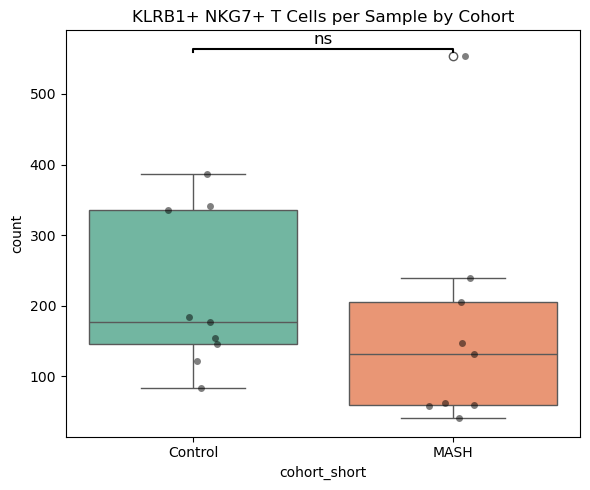
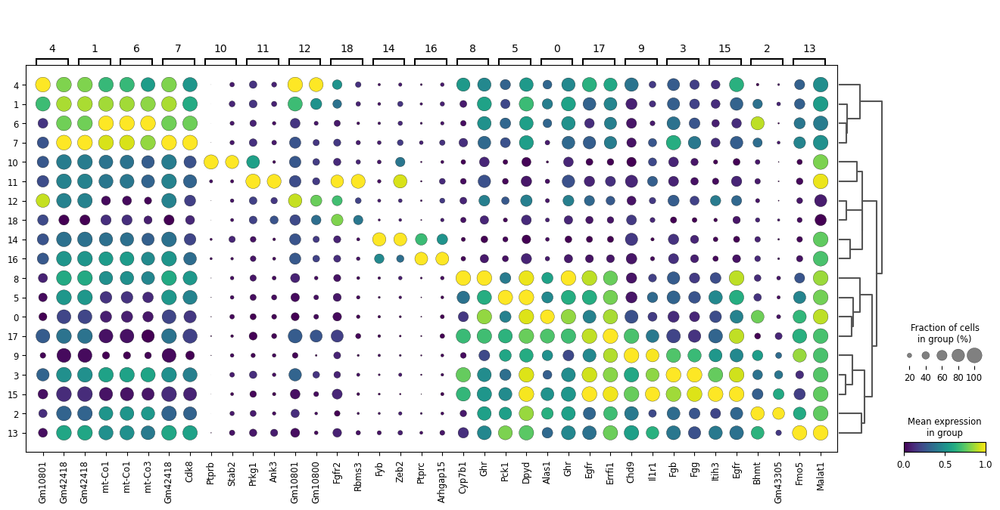

## Research Progress Update (2025-06-27 13:07:39)

This update introduces `notebook_1_liver_analysis_1.ipynb` for single-cell RNA-seq analysis of `liver_liveTissue_RNA.h5ad` using `scanpy`. The notebook performs data loading, preprocessing (normalization, log-transformation, highly variable gene selection), dimensionality reduction (PCA, UMAP), Leiden clustering, and marker gene identification. Key figures include UMAP visualizations colored by pre-existing cell types (Figure 1) and by newly computed Leiden clusters (Figure 2).

---

## Research Progress Update (2025-06-27 13:33:04)

The updates across `notebook_2_liver_xenium.ipynb` and `notebook_1_liver_analysis_1.ipynb` primarily focus on refining cell type analysis and spatial insights from mouse liver data.

*   `notebook_2_liver_xenium.ipynb` was newly created to perform a comprehensive Xenium spatial transcriptomics analysis. This notebook loads `xenium_adata.h5ad`, identifies `NKG7+ KLRB1+ T/NK` cells, characterizes their spatial proximity to other cell types, and compares their prevalence between 'Control' and 'MASH' cohorts using a Mann-Whitney U test (Figure: `KLRB1+ NKG7+ T Cells per Sample by Cohort`). Initial QC histograms are also generated (Figure: `Total transcripts per cell` and `Unique transcripts per cell`).

*   `notebook_1_liver_analysis_1.ipynb` underwent a refinement in its single-cell RNA-seq analysis of `liver_liveTissue_RNA.h5ad`. The Leiden clustering resolution was adjusted from `1.0` to `0.8` (Figure: `Leiden_0.8 UMAP`), leading to a recalculation of marker genes based on the new cluster definitions.

---

## Research Progress Update (2025-06-27 13:41:52)

Initiated `notebook_3_liver_snRNA.ipynb` to analyze single-nucleus RNA sequencing data from `liver_frozenTissue_RNA.h5ad`. The analysis includes standard Scanpy preprocessing (normalization, log-transform, highly variable gene selection), dimensionality reduction (PCA, UMAP), Leiden clustering, and initial marker gene identification via t-test. Key figures generated include UMAPs colored by pre-defined cell types (Figure 1) and by new Leiden clusters (Figure 2), and a dot plot showing top marker genes (Figure 3). Notebooks `notebook_1_liver_analysis_1.ipynb` and `notebook_2_liver_xenium.ipynb` remained unchanged.

---

## Research Progress Update (2025-06-27 14:14:18)

Updated the `notebook_3_liver_snRNA.ipynb` to capture all cell outputs, specifically running a previously unexecuted print statement. No changes were made to the code, input file (`liver_frozenTissue_RNA.h5ad`), or the generated figures (UMAP plots and dot plot of marker genes). Notebooks `notebook_2_liver_xenium.ipynb` (input: `xenium_adata.h5ad`) and `notebook_1_liver_analysis_1.ipynb` (input: `liver_liveTissue_RNA.h5ad`) remain unchanged.

---

## Research Progress Update (2025-06-27 14:23:55)

Updated the snRNA-seq analysis (`notebook_3_liver_snRNA.ipynb`) to include an additional UMAP visualization with a frame, facilitating comparison (Figure: `notebook_3_liver_snRNA_cell6_out2.png`). Also added an empty cell for future work. No changes were made to `notebook_2_liver_xenium.ipynb` or `notebook_1_liver_analysis_1.ipynb`. Input files remain `/Users/jamesbolepan/Documents/research_LiverStress_Immune/rds_manual_extract/liver_frozenTissue_RNA.h5ad`, `/Users/jamesbolepan/Documents/research_LiverStress_Immune/xenium_manual_extract/xenium_adata.h5ad`, and `"/Users/jamesbolepan/Documents/research_LiverStress_Immune/rds_manual_extract/liver_liveTissue_RNA.h5ad"`.

---

## Research Progress Update (2025-06-27 14:33:40)

No functional changes detected across `notebook_3_liver_snRNA.ipynb`, `notebook_2_liver_xenium.ipynb`, and `notebook_1_liver_analysis_1.ipynb`. The only modification was a print statement in `notebook_1_liver_analysis_1.ipynb` (Cell 3) updated from "Hello world" to "Hello world from Antonia's code!".

---

## Research Progress Update (2025-06-27 14:39:17)

Added an R magic command cell which resulted in an error, and shifted cell ordering. Analyzed live tissue RNA data from `/Users/jamesbolepan/Documents/research_LiverStress_Immune/rds_manual_extract/liver_liveTissue_RNA.h5ad` using standard scanpy preprocessing, clustering, and differential gene expression analysis.

---

## Research Progress Update (2025-06-27 14:51:54)

This update introduces data subsampling to `notebook_1_liver_analysis_1.ipynb`, reducing the analyzed cell count by 90%. Subsequent PCA, UMAP, and Leiden clustering analyses are now performed on this subset. `notebook_3_liver_snRNA.ipynb` and `notebook_2_liver_xenium.ipynb` remain unchanged.

---

## Research Progress Update (2025-06-27 14:58:49)

The notebook `notebook_3_liver_snRNA.ipynb` was updated to include a new dotplot visualizing the top 5 marker genes for each Leiden cluster, enhancing the characterization of cell populations. The `notebook_1_liver_analysis_1.ipynb` was updated by increasing the data subsampling fraction from 0.1 to 0.9, significantly expanding the analyzed cell count. The notebook `notebook_2_liver_xenium.ipynb` showed no changes between versions.

---

